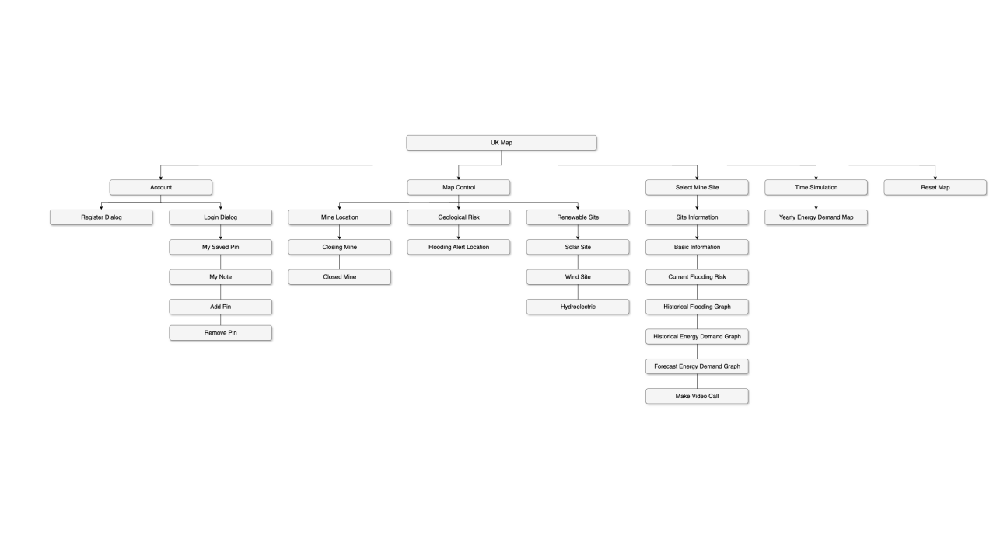
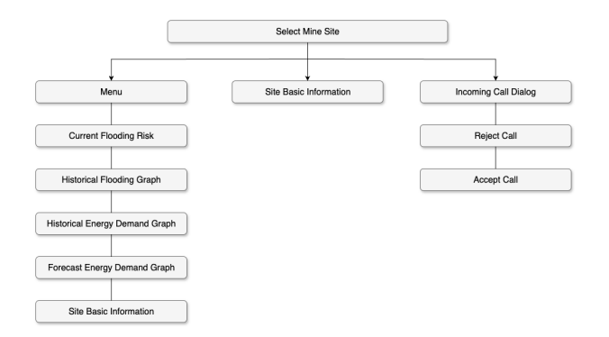
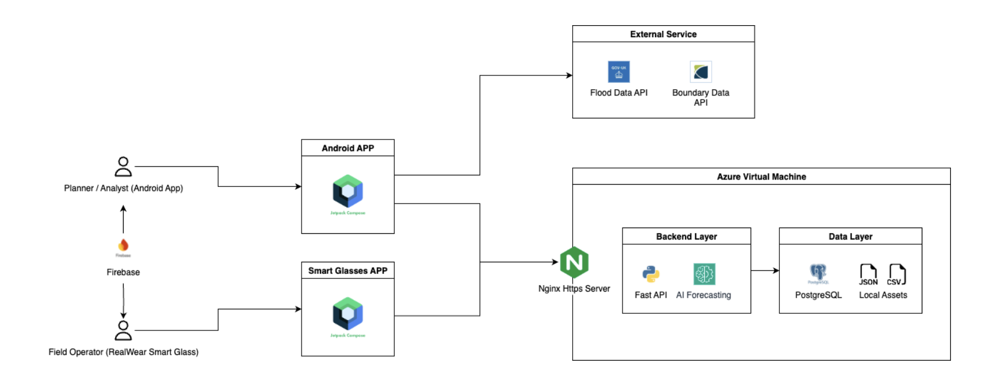
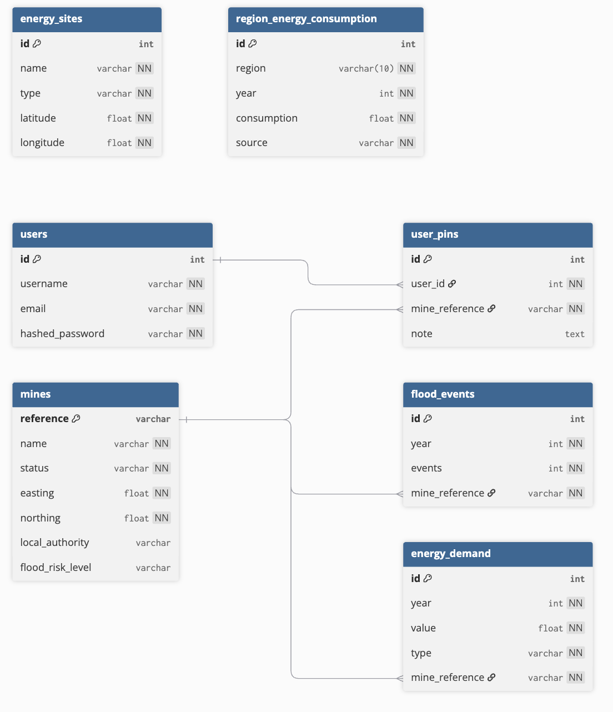

# Energy-Grid-Immersive-Analytics
A UCL IXN project focused on immersive energy grid data analytics.
[Video Demo →](https://drive.google.com/file/d/1j9KDJKRgpUUIJNs5Pks_0t5vu8TqnJu7/view)

## Features
This project consists of two main applications: a Smart Glasses application for on-site operators, and an Android application for monitoring and analysis.

- **Smart Glasses Application:** Enables on-site operators to view mine site data and handle video calls hands-free.
    - Controls the smart glasses using voice commands
    - Selects a mine site from the database and views its basic mine site information, local flooding trends, historical energy demand trends, and forecasted energy demand trends
    - Accepts or rejects incoming video calls from the Android application

- **Android Application:** Provides an interface to explore mine sites, energy data, and geological risks.
    - **Interactive Map**
        - Displays locations of closed or closing mines
        - Displays geological risk areas (e.g., flooding)
        - Displays renewable energy facilities (e.g., wind farms, solar plants)
    - **Site Marking & Annotation**
        - Allows user sign-up and login
        - Places pins on the map to mark potential energy storage sites
        - Annotates pins with custom notes (e.g., “High-Potential Gravity Storage”)
    - **Energy Demand Visualisation**
        - Overlays time-based electricity demand projections (historical and forecast) on the UK map
    - **Video Communication**
        - Initiates video calls with on-site operators

## Sitemap
### Android Application Sitemap

### Smart Glasses Application Sitemap

## Prototype
You can view the Figma prototype here:  
[Figma Prototype →](https://www.figma.com/design/OQmP5Oy1DRHOOuSBoV6fce/Untitled?node-id=1-142&t=QEvBvoJhwFXfmGFQ-1)

## System Architecture

## Database Schema

## Build & Run
### Build Variants

You can switch between **phone** and **wear** variants in Android Studio:

1. Open **Build Variants** panel (View/Tool Windows/Build Variants).
2. In the **Module: app** row, change the **Active Build Variant** to either:
    - `phoneDebug` → builds the Phone app
    - `wearDebug` → builds the Wear app
3. Run or build the project as usual.

### APK Output

The APKs are already built — you can install them directly without building:

- **Phone build**  
  `app/build/outputs/apk/phone/debug/app-phone-debug.apk`

- **Wear build**  
  `app/build/outputs/apk/wear/debug/app-wear-debug.apk`

 ## Tech Stack
 - Jetpack Compose (Kotlin)
 - FastAPI (Python)
 - Facebook Prophet
 - PostgreSQL
 - WebRTC
 - Firebase
 - Docker
 - Azure
 - Nginx

## Appendix
### Code Structure
The main project folders and entry points:

#### Phone Application
- **Activity**: `app/src/main/java/com/ucl/energygrid/MainActivity.kt`
- **Manifest**: `app/src/phone/AndroidManifest.xml`

#### Smart Glasses Application
- **Activity**: `app/src/main/java/com/ucl/energygrid/WearMainActivity.kt`
- **Manifest**: `app/src/wear/AndroidManifest.xml`

#### Backend Service
- **Root**: `backend/`
- **Entry Point**: `backend/app/main.py`

### Data Sources
- **Flooding Risk Data** – [Environment Agency Flood Monitoring API](https://environment.data.gov.uk/flood-monitoring/id/floods)  
  Provides real-time flood alerts across the UK.
- **Renewable Energy Sites** – [UK Government Renewable Energy Planning Database (REPD)](https://www.gov.uk/government/publications/renewable-energy-planning-database-monthly-extract)  
  Contains locations of renewable energy facilities, such as wind farms and solar plants.
- **Electricity Consumption Statistics** – [Regional and Local Authority Electricity Consumption Statistics](https://www.gov.uk/government/statistics/regional-and-local-authority-electricity-consumption-statistics)  
  Provides historical electricity demand data by region, up to 2023.
- **Geospatial Boundaries** – [UK NUTS Level 1 Regional Boundaries (ONS, 2018)](https://geoportal.statistics.gov.uk/datasets/44c039e762d94a42bf5e0580e8dd9f84_0/explore?location=55.193166%2C-3.316972%2C6.34)  
  Provides geographic boundaries for UK regions at NUTS Level 1.
